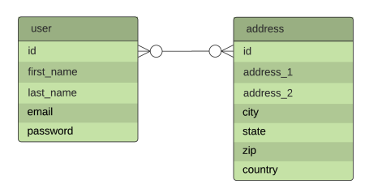
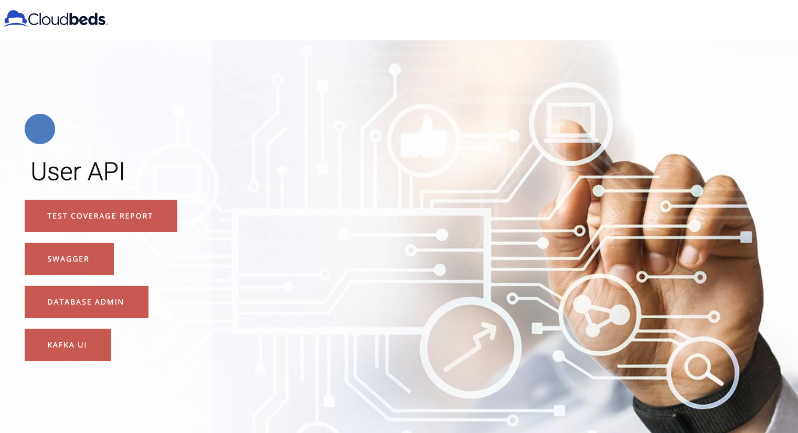

# Platform Take-Home Interview Challenge

## A simple user microservice

We have 2 basic tables: user and address. Use the Java Spring Boot framework and create a REST Service to allow for user administration. You’
re free to use any fitting data types you’d like.

REST API requirements:
* Create users with input params: user (first name, last name, email and password), and addresses
* Retrieve users by country

Kafka Event requirements:
* Publish user creation messages in a Kafka topic
* Write a sample/test consumer to consume messages and print out user names.

Deliverables:
* API contract design
* Working code with unit tests

Presentation (schedule later):
* Show case working APIs, message publishing and consuming

## Solution

To accomplish the goals described on the assignment a spring application was built with 2 main modules:
* user-api - The main module containing all the logic to receive the HTTP requests, persist them into the database and also send them to the kafkfa topic
* user-consumer - Simple spring-boot application that contains a subscriber for that topic on kafka and print the users being sent to the topic.

# Development environment 

To be able to run the dev environment locally without needing to install anything some tasks are provided in the [Makefile](./Makefile): 
* dev-start - starts all infrastructure containers available on [this docker-compose](./docker/docker-compose.yml) file;
* dev-stop - stops all infrastructure containers
* stack-start - starts the whole solution including the apps. **Important : the application should be built first**
* stack-stop - stops all containers from the task above
* build - builds the entire application
* run-api - starts the **user-api** module. **Important: the infrastructure containers must be up and running (from task dev-start)**
* run-consumer - starts the **user-consumer** module. **Important: the infrastructure containers must be up and running (from task dev-start)**

Once the application is started you should be able to access its landing page on [http://localhost:8080](http://localhost:8080):

